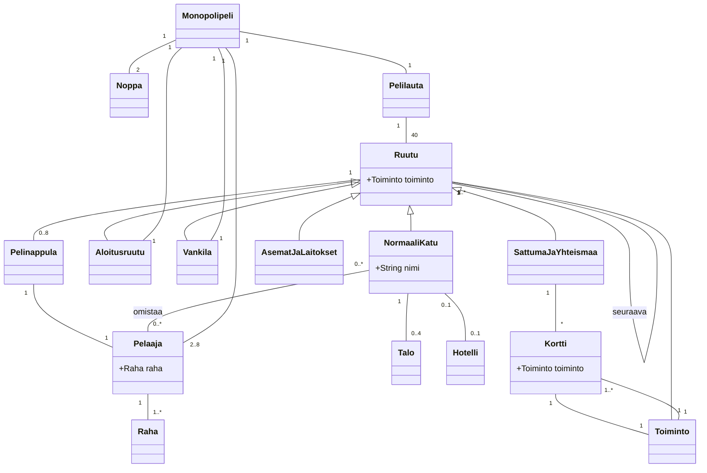

```mermaid
 classDiagram
    Monopolipeli "1" -- "2" Noppa
    Monopolipeli "1" -- "1" Pelilauta
    Pelilauta "1" -- "40" Ruutu
    Ruutu "1" -- "1" Ruutu : seuraava
    Ruutu "1" -- "0..8" Pelinappula
    Pelinappula "1" -- "1" Pelaaja
    Pelaaja "2..8" -- "1" Monopolipeli
    Ruutu <|-- Aloitusruutu
    Ruutu <|-- Vankila
    Ruutu <|-- SattumaJaYhteismaa
    Ruutu <|-- AsematJaLaitokset
    Ruutu <|-- NormaaliKatu
    Monopolipeli "1" -- "1" Aloitusruutu
    Monopolipeli "1" -- "1" Vankila
    NormaaliKatu "1" -- "0..4" Talo
    NormaaliKatu "0..1" -- "0..1" Hotelli
    NormaaliKatu "0..*" -- "0..*" Pelaaja : omistaa
    Pelaaja "1" -- "1..*" Raha
    Toiminto "1" -- "1..*" Ruutu
    Toiminto "1" -- "1..*" Kortti
    SattumaJaYhteismaa "1" -- "*" Kortti
    Kortti "1" -- "1" Toiminto

    class Ruutu{
        +Toiminto toiminto
    }
    class NormaaliKatu{
        +String nimi
    }
    class Talo{
    }
    class Hotelli{
    }
    class Pelaaja{
        +Raha raha
    }
    class Raha{
    }
    class Toiminto{
    }
    class Kortti{
        +Toiminto toiminto
    }

```